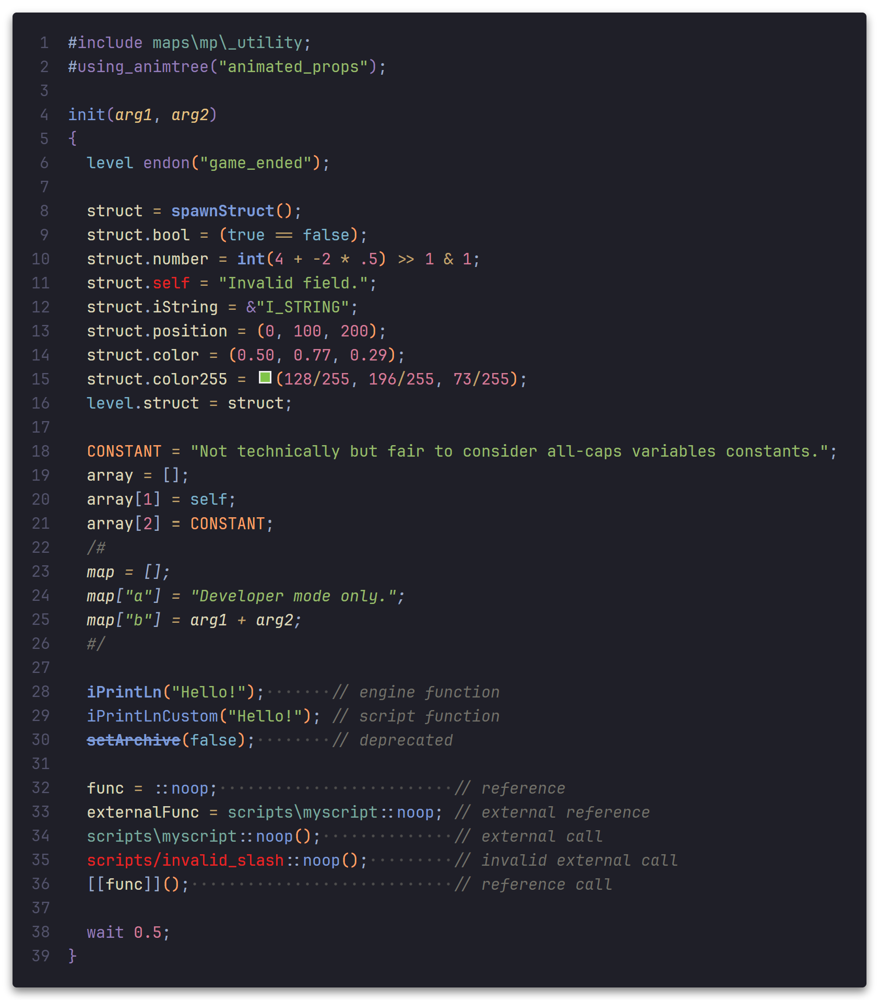

# Call of Duty *GSC (Game Script)* for Visual Studio Code

This extension adds support for the GSC (game script) language to Visual Studio Code.
It currently supports the following engine versions:
- IW3
- IW4

## Features

- **Syntax highlighting**
- **Snippets**
- **Code completion**
	- engine & script-defined functions/methods
		- documentation *(supports ScriptDoc)*
		- function signatures
	- script paths
- **Inlay hints for parameter names**
- **Color picker for applicable vectors**
- **Go to definitions**

## Configuration

> [!IMPORTANT]  
> To make use of code completion regarding other scripts, root script directories must be added
> to the `GSC.rootDirectories.*` settings.
> This includes a game's stock files (which are not included in this extension).

This extension provides the following settings:

- `GSC.intelliSense.enable.keywords`: Suggest keywords (if, for, switch, ...) with IntelliSense.
- `GSC.intelliSense.enable.callablesGame`: Suggest inbuilt (engine) functions and methods with IntelliSense.
- `GSC.intelliSense.enable.callablesScript`: Suggest script-defined functions and methods with IntelliSense.
- `GSC.intelliSense.conciseMode`: Make documentation entries more concise.
- `GSC.intelliSense.foldersSorting`: Configure folder/file sort order in suggestions.
- `GSC.colors.enable`: Display color picker on applicable vector literals.
- `GSC.featureSets.*`: Enable/disable features per engine version.
- `GSC.rootDirectories.*`: Root directory paths where stock or custom GSC files are found per engine version.

## Documentation
The documentation of engine features is very much work in progress.
This extension uses documentation provided by [Muhlex/gsc-doc](https://github.com/Muhlex/gsc-doc).
Contributions (especially for fully undocumented IW4 functions) are welcome.

Credit to [Raid-Gaming/script-reference-api](https://github.com/Raid-Gaming/script-reference-api)
for the initial IW3 docs.
